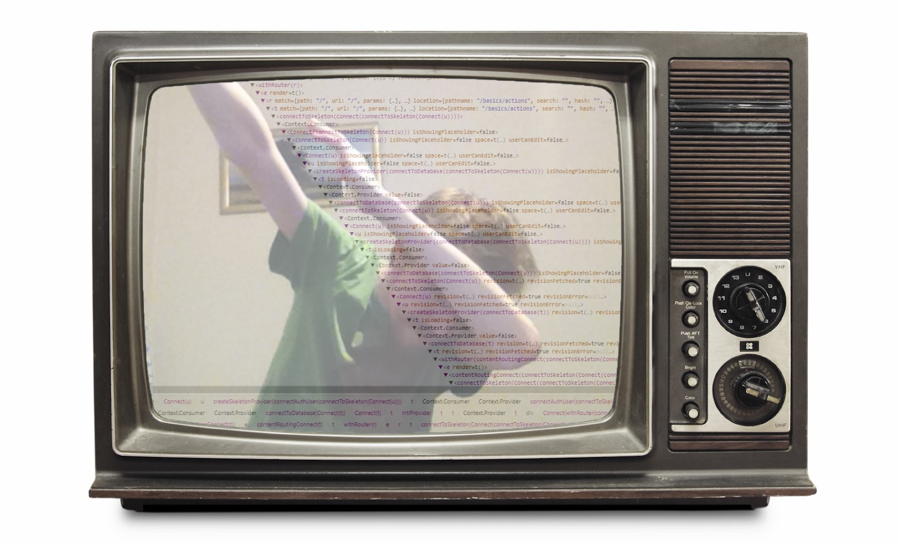
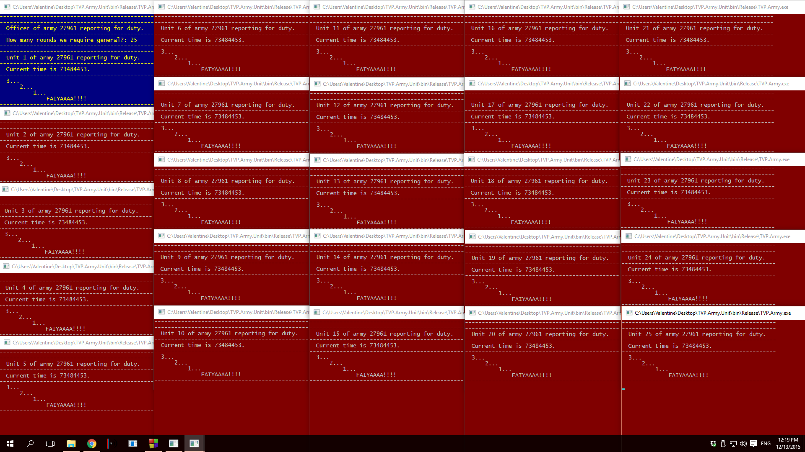

| engineer.md |
| - |

# How I Learned to Stop Worrying and Love Programming

<!--<video autoplay muted loop style="max-width:100%" src="intro.mp4"></video>-->

**\*record scratch\* \*freeze frame\***  
Yup, that's me.  
You're probably wondering how I ended up here?  
It all started with a couple of books...

# Childhood

## My first ever programming books
My dad had these. Actually, he had the first three, to this day I do not know
where he got them from. I mean I can ask him, but where's the fun in that
¯\\\_(ツ)\_/¯. The JavaScript one I asked my dad for after fooling around with the
first three. After figuring out how html pages worked, I wanted to make them more
interactive, and this would prove to be a trend for things I would be interested
in.

Now, I said "html pages" because, and this is a very funny thing for me now
looking back at it, I haven't at that time even been on the internet once. We
did not have internet at home, my dad had it at work but I never went there, so
my understanding of what the internet was came entirely from reading these
books. I knew that somehow, someway, using special programs I can put things in
that "Internet" and other people using other programs, "Browsers" can see the
things I put out there on that "Internet". And that idea was thrilling. I always
enjoyed sharing things I did with others, so the idea that one day I might be
able to share my weird interests acros the world was epicly ecpic.

And this was the start of it all. On my dad's dying laptop, without any access
to the internet I started fooling around in Microsoft Notepad, creating
`index.html` files and trying to figure out how to make a website name be on all
pages without having to write it on each manually.

## Modularity and Interactivity

From the very early stages of my interest in programming, first implicitly and
later explicitly, manifested my interests in two concepts: **modularity** and
**interactivity**.

**Modularity** is simple, it consists of breking things apart and connecting
them back together. A simple example I gave above, a header of an html page, you
break it apart from the page, make into a separate entity and then figure out
how to connect it back to the page, how to combine now two things into one. To
this day, this is one of my favorite things to do to a project, figure out how
it could be improved by making it modular.

**Interactivity** is a bit more complex.
> Interactive - (of two people or things) influencing each other.  
> Google thing

It's complicated because of how the word is used, for example: when you read a
book and flip through its pages, or when you go on a website and hover over the
menus and click on random buttons that kind of interface is called interactive,
because you are interacting with these things, however when I say interactive
here I imply that the thing you are interacting with has "meaningfull" internal
state. Like, when you navigate around a website, you are not changing it in any
way, it can be understood at rotating an object and looking at it from a
different side, same with a book. But, if we take a game for example, or a
social media website, it has its internal state, it is "living" by itself, and
we can influence it as outsiders. That kind of interactivity is what I'm talking
about here, this is what always interested me, this is why I asked my father to
buy me that JavaScript book I mentioned earlyer. Making games and later game
engines became my hobby and is one of those things I constantly rebound to. You
get to create some world, set its internal laws, bring it to life and allow
others to influence it through some "projection" of their self into that world.
I absolutely ❤️ it.

Thus, my interest in these two concepts of **modularity** and **interactivity**
laid the foundation for my personal project for years to come.

# School

In school I continued developing my web dev skillset and picked up robotics as a
side hustle of sorts.

## Of websites

I am quite introverted, and so was a commoner at the library, and having
expressed unending hunger for computer related books was asked by the librarian
to help her out with the library's web page on our schools web site. I helped
her on multiple occasions and soon I was helping out our informatics teacher
with the entierty of our school site which ran on Narod.ru which is a legendary
web hosting and templating engine from those early days on runet, I'm proud that
I happened to be at the right time in the right place to be a part of that
history.

However the school's website was not using Narod's templating engine but rather
some sort of custom thing said informatics teacher dug up somewhere on the
internet. My job was to patch things that were broken in unintuitive ways and
add custom cool interactivity to the website.

## Of Machines and GUIs

tl;dr: Once I saw a photo promoting our school's Lego Midstroms robotics club,
joined and it was hella fun, i got secong place at our city only because my
robot's epic arm fell of out of nowhere, but was still chosen to represent my
city on the reginal competition by the commitee because my robot was better, but
did not perticipate because the new robot that I had to create for the regional
competition was not coming along and I, understanding that it would not be ready
in time refused to perticipate with what would essentialy be just a car and not
a propper robot that would be able to complete the obstacle course. Phew, that
was uttered in one breath)

## Of Pascal and Delphi

Having helped my teacher out with the school's website I ended up in an
afterschool programming class. We learned Pascal. And i went out and bought
myself this bad boy:

It is by far one of my favorite books on programming I've ever owned a phisical
copy of. One reason: it's structured as a reference. At a glance I could look up
some concept or syntax and implement it. This book really cemented my learning
style, I learn by playing with things, I just look at them and try to implement
whatever cool ideas I have, and then later through polishing personal projects
and leasure time reading perfect the concepts and their implementations.

Having learned Pascal ahead of the school course I basicaly had nothing to do on
out Informatics class by the time my classmates were leraning programming, so to
the annoyance of everybody in the class I just fooled around in Delphi creating
all sorts of crazy interface and projects. It was the legendary Borland Delphi 7
and also look back fondly at that time that I got be a part of what would go on
to attain a cult status among developers.

## Lucky me, or the tale of 2 PCs
At the age of 14 I got a laptop and a desktop almost at the same time. They were
my fisrt personal computers, no longer did I have to hang around at school or in
the city library or beg father to let me use his slow-ass laptop. I had my own
shit now. And most inportantly I had 2 of them. That allowed to make my laptop a
fortress of stability rocking a Windows 7 and turn my desktop into a platform
for all sorts of experiments spaning from installing every os under the sun to
fooling around with all sorts of hardware I acuired from relatives and random
people I knew. I still have 2 bricked HDD's lying around from that time, maybe
I'll get them restored at some point 🤔

### How I tried to "install" Gentoo Linux at the age of 14
Oh boi is that a story or what! Anyone who knows anything about Linux knows,
Gentoo aint' no joke to install. Now imagine a kid who have never even installed
Windows going at it. That. Was. Painful.

To be honest I actually didnt manage to pull it off at the time, and, just for
the record, I actually never installed Gentoo ever since than, for within a
couple of years I found my love and peace in the light of our lord and saviour
Arch.

Anhow I got myself this book and it became my guide in all things linux for my
early linux days, however at this point I slowly started transitioning to online
resources, at first I would print them out tho 🤦

# University

## My last proper programming book
And by propper I mean I almost read it like a book, and not just like a
reference, I believe I read a couple of chapters start to end like a chapter on
pointers and data structures or something of a kind.

---

---

# Meta-university

# Post-university

I went to a millitary. Was a "hacker". Pretty cool, I liked it, was hella fun.

## Tumbleweed
Of Runaways and Stowaways

<video autoplay muted loop src="tw-sphere.mp4"></video>
<video autoplay muted loop src="tw-cube.mp4"></video>

## Flatworld

Fullscreen version available [here](/game.html)

<iframe src="/game.html" frameBorder="0" style="width:100%; height:400px"></iframe>

# So far that's all ¯\\\_(ツ)\_/¯

